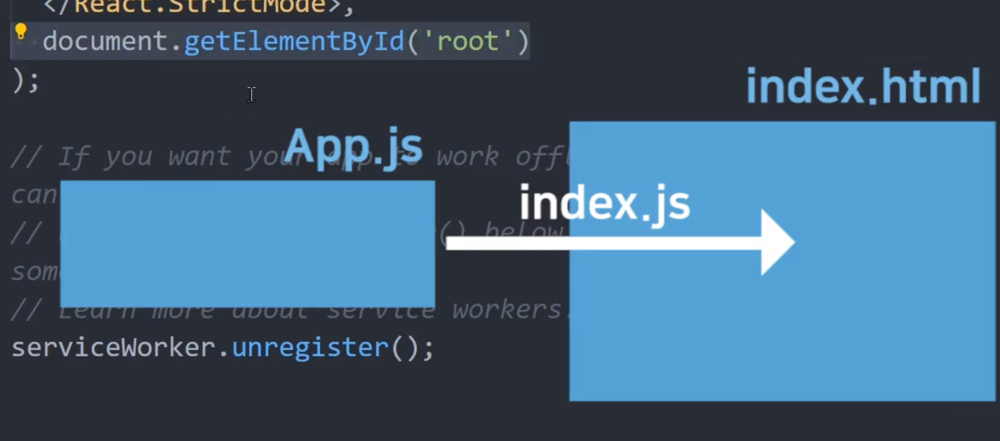
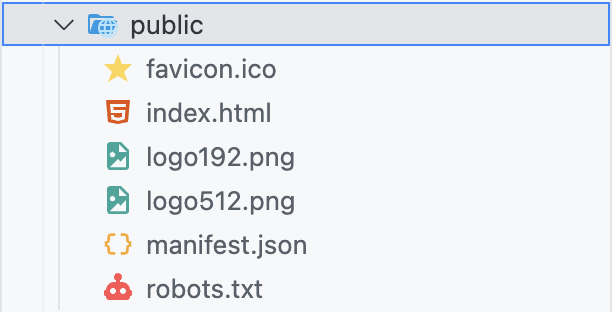
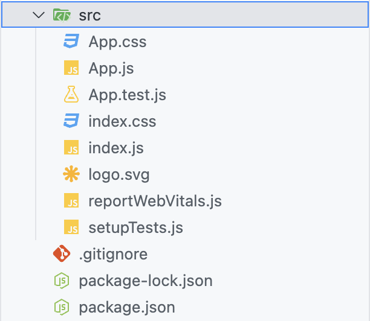

# 전체 목차

[React 환경세팅](#react-환경세팅-for-m2)

[React에 대한 지식](#react-궁금증-해결)

# React 환경세팅 for M2

### 📋 목차

1. [NVM(Node Version Manager) 설치](#1-nvmnode-version-manager-설치)
2. [Node.js 설치](#2-nodejs-설치)
3. [yarn 설치](#3-yarn-설치)
4. [React 프로젝트 생성](#4-리액트-프로젝트-생성)

<br><br>

## 1. NVM(Node Version Manager) 설치

⭐️**참고 링크**⭐️ [ https://github.com/nvm-sh/nvm ] 

### How to install?

**Step One** <br>

```
curl -o- https://raw.githubusercontent.com/nvm-sh/nvm/v0.40.1/install.sh | bash
```

```
wget -qO- https://raw.githubusercontent.com/nvm-sh/nvm/v0.40.1/install.sh | bash
```

<br>

**Step Two** <br>

```
export NVM_DIR="$([ -z "${XDG_CONFIG_HOME-}" ] && printf %s "${HOME}/.nvm" || printf %s "${XDG_CONFIG_HOME}/nvm")"
[ -s "$NVM_DIR/nvm.sh" ] && \. "$NVM_DIR/nvm.sh" # This loads nvm
```

<br>

**Example**

```
$ nvm install 20    # Node.js 20 LTS 버전 설치
$ npm use 20        # Node.js 20 버전 사용

$ npm install -g npm@10.9.0
```

<br>

**설치 및 버전 확인** <br>

```
$ nvm --version

$ node -v

$ npm -v
```

<br><br>
## 2. Node.js 설치

### How to install?

⭐️**다운로드 링크**⭐️ <br>

[ https://nodejs.org/en/ ]

### 설치하는 이유?

**create-react-app** 라이브러리 때문

→ node.js를 설치하면 "**npm**"을 사용할 수 있음

<br><br>
## 3. yarn 설치

### How to install?

```
$ brew update
$ brew install yarn
$ yarn config set prefix ~/.yarn
```

**확인**

```
$ yarn --version
```

<br><br>
## 4. 리액트 프로젝트 생성

### Visual Studio Code

```
$ npx create-react-app [프로젝트 이름]
$ cd [프로젝트 이름]
$ npm start
```

#### React App 생성 [npx create-react-app [프로젝트 이름]]


<br><br>

#### React 실행 [npm install]

<div>
  
  
</div>

<br>

#### Success!


<br><br>

### IntelliJ


<br><br><br>

# React 궁금증 해결

### App.js / index.html / index.js의 관계



### node_modules 폴더

: 라이브러리를 전부 모아둔 폴더 <br>


### public 폴더

: static 파일 보관함 (public 안의 파일들은 compile을 할 때, 압축이 되지 않음) <br>



### src 폴더

: source code 보관함 <br>



### package.json

: 내가 설치한 라이브러리(및 버전) 목록 <br>


<br><br>

## JSX 문법

1. 태그에 class를 주고 싶으면? <br>

```js
<div className="클래스명">
```

<br>

2. React에서 Data Binding 쉽게 하는 방법 <br>

: { ***변수명*** } | 괄호 안에 변수 넣어주기
: { ***함수명()*** } | 괄호 안에 함수 넣어주기
```jsx
function App() {

      let posts = "React 공부 방법 1"

      function 함수() {
            return 100;
      }

      return (
            <div className="App">
                  <div className='black-nav'>
                        <div>React 개발 Blog</div>
                  </div>
                  <h4> { posts } </h4> // 변수 데이터바인딩
                  <h4> { 함수() } </h4> // 함수 데이터바인딩
            </div>
      );
}
```

<br>

: { img src={***이미지명***} } | 괄호 안에 이미지 넣어주기
```jsx
import logo from './logo.svg' // 이미지 import

function App() {
      return (
            <div className="App">      
                  <div className='black-nav'>
                        <div>React 개발 Blog</div>
                  </div>
                   // 이미지 데이터바인딩
            </div>
      ); 
}
```
<br>

: src / id / href 등의 속성에도 데이터바인딩 가능!

3. JSX에서 style 속성 집어넣을 때
: style={ object 자료형으로 만든 스타일 }

```jsx
function App() {
      let posts = "reactReact"

      <div className="{ posts }"> // className에 데이터바인딩
            <div style={ {color: 'blue'} }> // div 태그에 데이터바인딩
                  React 재미있다!
            </div>
      </div>
}
```